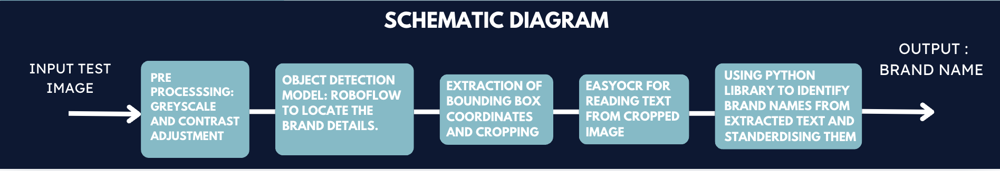
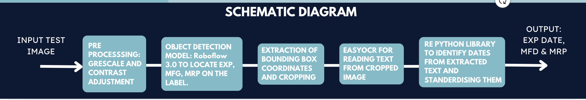
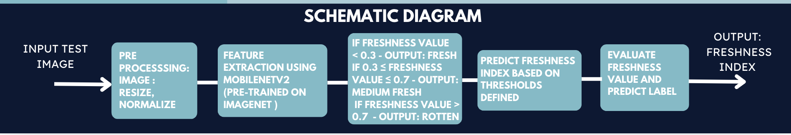
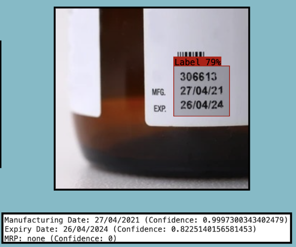
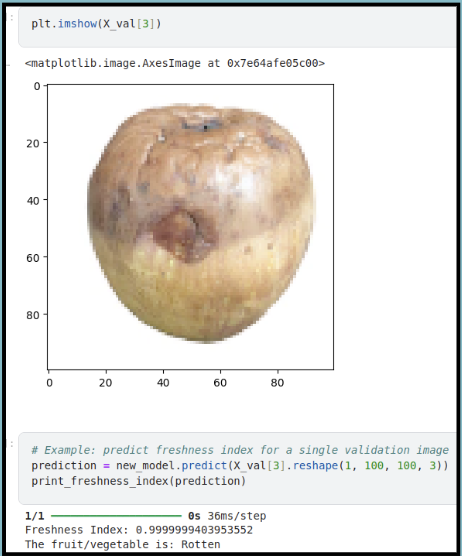

# 🛒 ShelfWise-AI

**ShelfWise-AI** is an intelligent, AI-driven quality control system designed to streamline e-commerce logistics by ensuring product quality at every step. Developed by **Team No More Panoti** from **Indira Gandhi Delhi Technical University for Women (IGDTUW)**, this project specializes in FMCG and fresh produce inspection through the power of computer vision and deep learning. 

## 🌟 Team Members
- **Mahita Boyina**
- **Anamika Kumari**
- **Avni Goyal**

---

## 💡 Project Overview

ShelfWise-AI tackles critical challenges in quality assurance for e-commerce and retail logistics. Here’s how it works:

1. **📦 Packaging Label Extraction**  
   Extracts essential information (like brand name and net weight) from product packaging to ensure accuracy and compliance.

2. **📅 Expiry Date Validation**  
   Identifies and standardizes expiry dates, manufacturing dates, and MRP on packaging to maintain up-to-date product information.

3. **🍎 Freshness Prediction of Produce**  
   Assesses the freshness of fruits and vegetables, classifying them as fresh, medium fresh, or rotten based on visual analysis.

---
## 🛠️ Schematic Diagrams

Each component of ShelfWise-AI is represented in the schematic diagrams below. These diagrams provide an overview of the three main functions: packaging label extraction, expiry date validation, and freshness prediction.

### 1. Packaging Label Extraction

This module processes an input test image to detect and extract packaging label details. After grayscale conversion and contrast adjustments, Roboflow's object detection model locates key elements such as brand names and weights. The EasyOCR module reads the text from the cropped bounding box, and a Python script identifies and standardizes the brand name.

**Output:** Brand Name

### 2. Expiry Date Validation

This module identifies expiry and manufacturing dates along with the MRP by processing an input test image. After grayscale conversion and contrast adjustments, Roboflow’s object detection model locates relevant text on the packaging. EasyOCR reads the text from the cropped image, and a Python script identifies and standardizes dates for uniformity.

**Output:** Expiry Date, Manufacturing Date, MRP

### 3. Freshness Prediction of Produce

In this module, the input image undergoes resizing and normalization. MobileNetV2, pre-trained on ImageNet and fine-tuned for freshness detection, extracts features to predict the freshness index. Based on predefined thresholds, the system classifies produce into three categories: fresh, medium fresh, and rotten.

**Output:** Freshness Index

---

## 🚀 Technologies at a Glance

- **Object Detection**: Roboflow 3.0, trained for precise object localization
- **OCR**: EasyOCR for high-accuracy text extraction
- **Deep Learning Model for Freshness**: MobileNetV2 with transfer learning for freshness assessment

---

## 📊 Evaluation Metrics

Below are the performance metrics for each module in the ShelfWise-AI project, showcasing the accuracy and precision of our models in detecting freshness, reading package labels, and validating expiry dates.

- **Detecting Freshness in Fresh Produce**
  - **Training Precision**: 0.97 (Fresh), 1.00 (Rotten)
  - **Training Recall**: 0.99 (Fresh), 0.97 (Rotten)
  - **Validation Precision**: 0.94 (Fresh), 1.00 (Rotten)
  - **Validation Recall**: 1.00 (Fresh), 0.94 (Rotten)
  - **Overall Accuracy**: 97%

- **Reading Package Label**
  - **Mean Average Precision (mAP)**: 79.5%
  - **Precision**: 85.3%
  - **Recall**: 70.5%

- **Expiry Date Validation**
  - **Mean Average Precision (mAP)**: 80.3%
  - **Precision**: 88.0%
  - **Recall**: 74.4%

---

## 🖼️ Output Preview

Here’s a preview of the output generated by ShelfWise-AI, demonstrating each module's functionality.

*Brand detection from input test image*

*Expiry date, manufacturing date, and MRP extraction*

*Freshness detection for fruits and vegetables*

## 🎥 Demo Video

For a full demonstration of ShelfWise-AI in action, watch the video below:

*Click the image above to play the video.*
